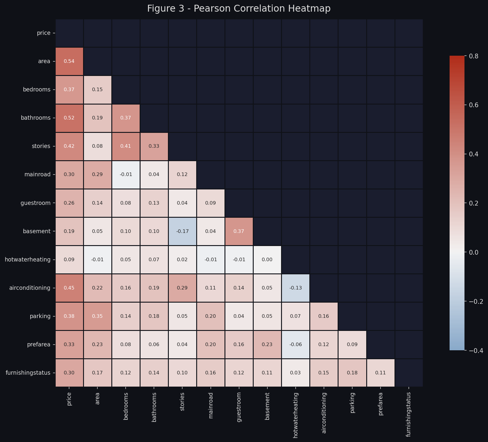
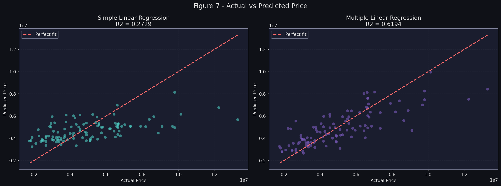
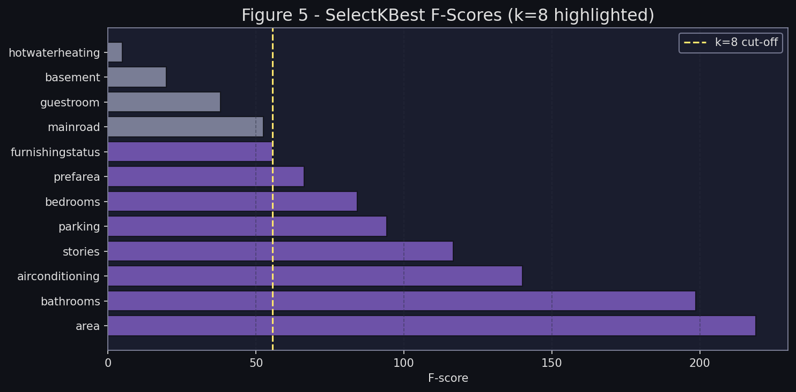
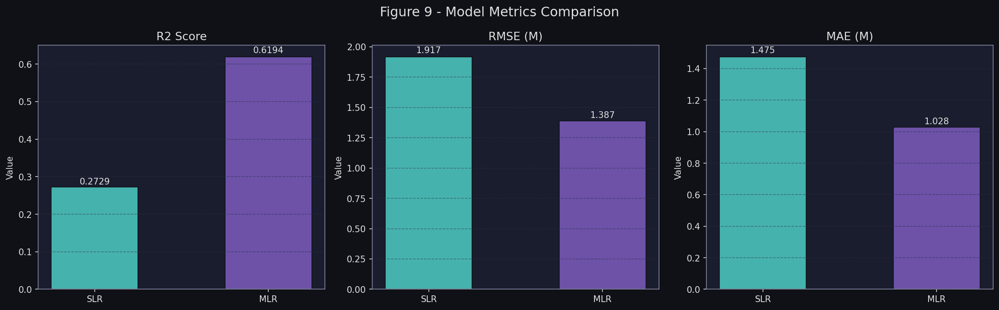

# House Price Prediction — Multiple Linear Regression with Feature Selection

> **課程 Course:** 智慧物聯網應用與實作 — HW3  
> **主題 Topic:** 利用多元線性回歸與特徵選擇預測房價  
> **日期 Date:** 2026-05-14  
> **資料集 Dataset:** [Housing Prices Dataset — Kaggle](https://www.kaggle.com/datasets/yasserh/housing-prices-dataset)

---

## Overview

This project applies **Simple Linear Regression (SLR)** and **Multiple Linear Regression (MLR)** to predict residential house prices using the Kaggle Housing Prices Dataset (545 records, 13 features). Feature selection is performed via **Pearson Correlation analysis** and **SelectKBest (F-regression)**, and the entire pipeline follows the **CRISP-DM** methodology.

---

## Project Structure

```
HW3/
├── Housing.csv                  # Raw dataset
├── housing_regression.py        # Main analysis script (CRISP-DM pipeline)
├── report.md                    # Full structured report
├── README.md                    # This file
├── conversation_log.md          # Session activity log
└── report_figures/              # Generated visualizations (10 figures)
    ├── fig1_price_distribution.png
    ├── fig2_categorical_counts.png
    ├── fig3_correlation_heatmap.png
    ├── fig4_corr_bar.png
    ├── fig5_selectkbest.png
    ├── fig6_mlr_coefficients.png
    ├── fig7_actual_vs_predicted.png
    ├── fig8_residuals.png
    ├── fig9_metrics_comparison.png
    └── fig10_cv_scores.png
```

---

## CRISP-DM Pipeline

| Phase | Description |
|-------|-------------|
| **1. Business Understanding** | Define prediction objective and success KPI (R² ≥ 0.60) |
| **2. Data Understanding** | EDA — distributions, categorical counts, missing value check |
| **3. Data Preparation** | Binary/ordinal encoding, Pearson correlation, SelectKBest (k=8) |
| **4. Modeling** | SLR (single feature: `area`) and MLR (top-8 features) |
| **5. Evaluation** | R², RMSE, MAE, residual analysis, 5-fold cross-validation |
| **6. Deployment** | Prediction function, REST API schema, deployment discussion |

---

## Feature Selection Results

Both methods (Correlation + SelectKBest) agreed on the **same top-8 features**:

| Rank | Feature | Pearson r | F-Score |
|------|---------|-----------|---------|
| 1 | `area` | 0.536 | 218.88 |
| 2 | `bathrooms` | 0.518 | 198.65 |
| 3 | `airconditioning` | 0.453 | 140.16 |
| 4 | `stories` | 0.421 | 116.78 |
| 5 | `parking` | 0.384 | 94.14 |
| 6 | `bedrooms` | 0.366 | 84.25 |
| 7 | `prefarea` | 0.330 | 66.26 |
| 8 | `furnishingstatus` | 0.305 | 55.58 |

---

## Model Results

| Metric | SLR (`area` only) | MLR (8 features) |
|--------|:-----------------:|:----------------:|
| **R² Score** | 0.2729 | **0.6194** ✅ |
| **RMSE** | ₹1,917,104 | **₹1,387,029** |
| **MAE** | ₹1,474,748 | **₹1,027,656** |

MLR improves R² by **+127%** and reduces RMSE by **-27.7%** over SLR.

---

## Sample Visualizations

| Correlation Heatmap | Actual vs Predicted |
|---|---|
|  |  |

| SelectKBest F-Scores | Metrics Comparison |
|---|---|
|  |  |

---

## Setup & Usage

### Prerequisites

```bash
pip install scikit-learn matplotlib seaborn pandas numpy
```

### Run the Analysis

```bash
python -X utf8 housing_regression.py
```

> **Note:** The `-X utf8` flag is required on Windows (CP950 console encoding) to correctly handle Unicode output.

All 10 figures will be saved to `report_figures/`. The console will print a full CRISP-DM walkthrough with metrics summary.

---

## Key Findings

- **`bathrooms`** carries the largest MLR coefficient (~₹1.15M per bathroom), followed by `airconditioning` (~₹807K) and `prefarea` (~₹781K), showing that **amenity quality and location matter more than raw size per unit**.
- Despite `area` having the highest single-feature correlation (r = 0.536), its per-unit coefficient in MLR is only ₹249/sq.ft — because area's effect is already partially captured by correlated features.
- The MLR model (R² = 0.62) meets the project success criterion and is suitable as a first-generation pricing advisory tool.
- Future improvements: polynomial features, Ridge/Lasso regularization, or ensemble methods (Random Forest, XGBoost).

---

## References

- Dataset: [Housing Prices Dataset — Yasserh @ Kaggle](https://www.kaggle.com/datasets/yasserh/housing-prices-dataset)
- Methodology: [CRISP-DM Reference Model](https://www.the-modeling-agency.com/crisp-dm.pdf)
- scikit-learn: [sklearn.linear_model.LinearRegression](https://scikit-learn.org/stable/modules/generated/sklearn.linear_model.LinearRegression.html)
- scikit-learn: [sklearn.feature_selection.SelectKBest](https://scikit-learn.org/stable/modules/generated/sklearn.feature_selection.SelectKBest.html)
