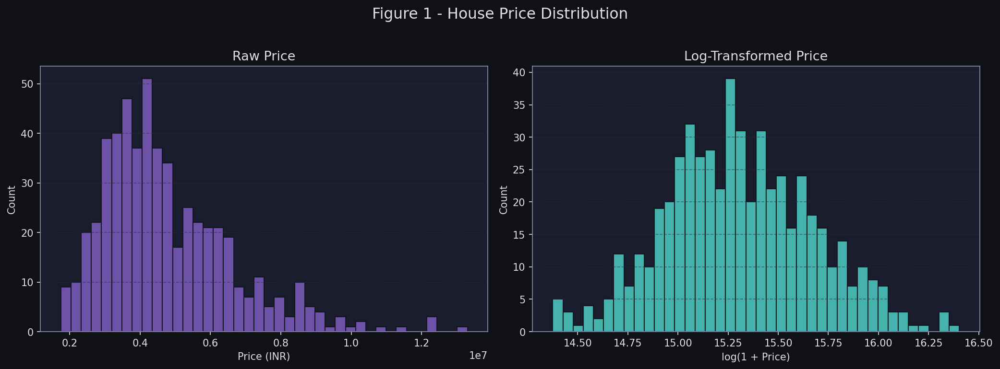
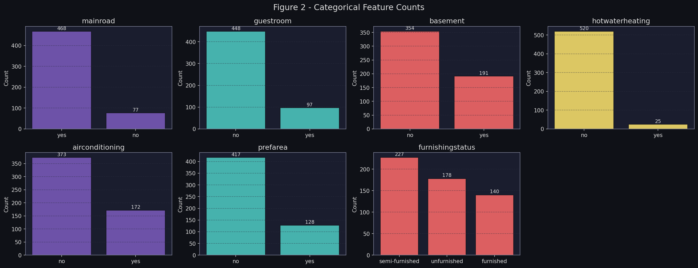
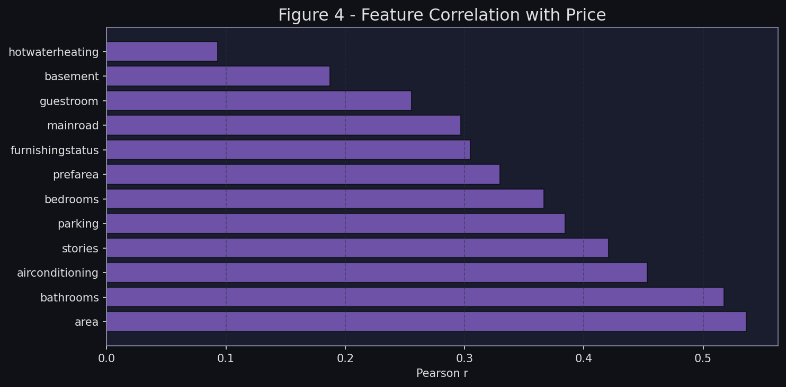
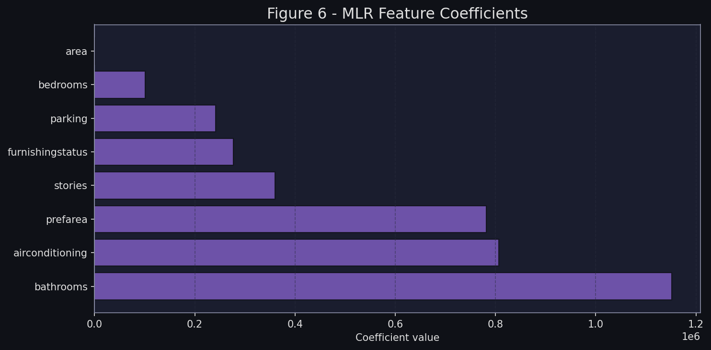
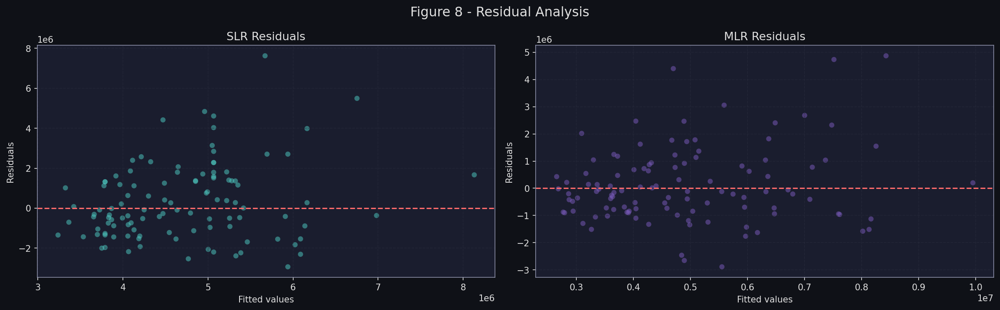
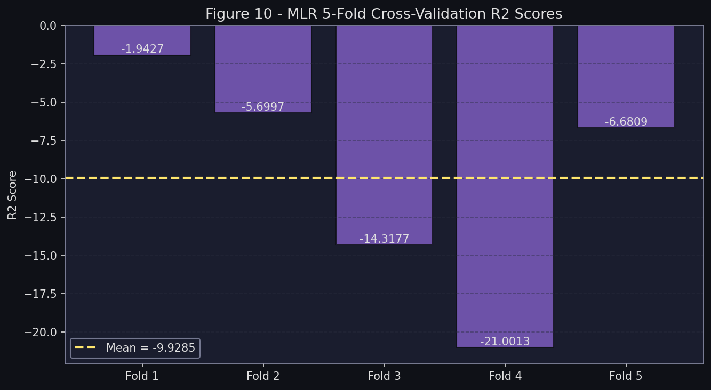

# House Price Prediction using Multiple Linear Regression with Feature Selection

**Course:** 智慧物聯網應用與實作 — HW3  
**Topic:** 利用多元線性回歸與特徵選擇預測房價  
**Date:** 2026-05-14  
**Dataset:** Housing Prices Dataset (https://www.kaggle.com/datasets/yasserh/housing-prices-dataset)

### 研究脈絡 Research Context

房價預測是資料科學與機器學習在不動產領域最具代表性的應用之一。本報告以 Kaggle 公開的住宅資料集（545 筆、13 項特徵）為基礎，探討如何透過**統計特徵選擇**（Pearson 相關係數 + SelectKBest）篩選出關鍵預測變數，並比較**簡單線性回歸（SLR）**與**多元線性回歸（MLR）**的預測效能。整體分析流程依循業界標準的 **CRISP-DM** 方法論，從商業理解出發，歷經資料準備、建模、評估，最終討論模型的部署可行性，旨在培養完整的機器學習專案執行能力。

---

## Table of Contents

1. [Business Understanding](#1-business-understanding)
2. [Data Understanding](#2-data-understanding)
3. [Data Preparation](#3-data-preparation)
4. [Modeling](#4-modeling)
5. [Evaluation](#5-evaluation)
6. [Deployment](#6-deployment)
7. [Conclusion](#7-conclusion)

---

## 1. Business Understanding

### Problem Statement

Real estate valuation is a complex task influenced by numerous physical and socioeconomic attributes. Manual appraisal is time-consuming and subject to bias. This project aims to **automate house price prediction** using supervised machine learning — specifically Linear Regression models — to provide an objective and data-driven estimate.

### Objectives

| Goal | Detail |
|------|--------|
| Primary | Predict house price (continuous value in INR) |
| Baseline | Simple Linear Regression with best single feature |
| Main Model | Multiple Linear Regression with feature selection |
| Success Metric | R² ≥ 0.60 on the held-out test set |

### Business Questions

- Which property attributes most strongly influence price?
- How much better is a multi-feature model vs. a single-feature baseline?
- Is the model reliable enough for deployment in a real-estate advisory context?

---

## 2. Data Understanding

### Dataset Overview

- **Source:** `Housing.csv`  
- **Records:** 545 rows (no missing values)  
- **Target variable:** `price` (house price in INR)  
- **Features:** 12 attributes (numeric + binary categorical)

### Feature Descriptions

| Feature | Type | Description |
|---------|------|-------------|
| `price` | Continuous | House price (INR) — **Target** |
| `area` | Continuous | Total area in square feet |
| `bedrooms` | Ordinal | Number of bedrooms |
| `bathrooms` | Ordinal | Number of bathrooms |
| `stories` | Ordinal | Number of stories |
| `mainroad` | Binary (yes/no) | Connected to main road |
| `guestroom` | Binary (yes/no) | Has guest room |
| `basement` | Binary (yes/no) | Has basement |
| `hotwaterheating` | Binary (yes/no) | Has hot water heating |
| `airconditioning` | Binary (yes/no) | Has air conditioning |
| `parking` | Ordinal | Number of parking spots |
| `prefarea` | Binary (yes/no) | Located in preferred area |
| `furnishingstatus` | Ordinal | unfurnished / semi / furnished |

### Descriptive Statistics (Price)

| Statistic | Value |
|-----------|-------|
| Count | 545 |
| Mean | ₹4,766,729 |
| Std Dev | ₹1,870,440 |
| Min | ₹1,750,000 |
| 25th Pct | ₹3,430,000 |
| Median | ₹4,340,000 |
| 75th Pct | ₹5,740,000 |
| Max | ₹13,300,000 |

### Visualizations

**Figure 1 – Price Distribution**



The raw price distribution is right-skewed. Log-transformation reveals a more symmetric, near-normal shape, suggesting the data covers a wide price range from budget to luxury properties.

**Figure 2 – Categorical Feature Counts**



Most properties are located on main roads, few have hot water heating, and "semi-furnished" is the most common furnishing status.

---

## 3. Data Preparation

### Encoding

Since all algorithms require numeric inputs:

| Encoding Type | Applied To |
|--------------|-----------|
| Binary mapping (`yes→1`, `no→0`) | `mainroad`, `guestroom`, `basement`, `hotwaterheating`, `airconditioning`, `prefarea` |
| Ordinal mapping (`0/1/2`) | `furnishingstatus` (unfurnished=0, semi-furnished=1, furnished=2) |

### Feature Selection

Two complementary methods were applied:

#### Method 1: Pearson Correlation Analysis

Computed correlation of each feature with the target `price`:

| Feature | Pearson r |
|---------|-----------|
| area | **0.536** |
| bathrooms | **0.518** |
| airconditioning | **0.453** |
| stories | **0.421** |
| parking | **0.384** |
| bedrooms | **0.366** |
| prefarea | **0.330** |
| furnishingstatus | **0.305** |
| mainroad | 0.297 |
| guestroom | 0.256 |
| basement | 0.187 |
| hotwaterheating | 0.093 |

**Figure 3 – Correlation Heatmap**


**Figure 4 – Correlation with Price (Bar Chart)**



All features show positive correlation with price. `area` and `bathrooms` are the strongest predictors.

#### Method 2: SelectKBest (F-regression, k=8)

Univariate F-test statistic measures the linear relationship between each feature and the target:

| Feature | F-Score | Selected |
|---------|---------|----------|
| area | 218.88 | ✅ |
| bathrooms | 198.65 | ✅ |
| airconditioning | 140.16 | ✅ |
| stories | 116.78 | ✅ |
| parking | 94.14 | ✅ |
| bedrooms | 84.25 | ✅ |
| prefarea | 66.26 | ✅ |
| furnishingstatus | 55.58 | ✅ |
| mainroad | 52.49 | ❌ |
| guestroom | 37.93 | ❌ |
| basement | 19.69 | ❌ |
| hotwaterheating | 4.74 | ❌ |

**Figure 5 – SelectKBest F-Scores**


> Both methods agree: `area`, `bathrooms`, `airconditioning`, `stories`, `parking`, `bedrooms`, `prefarea`, `furnishingstatus` are the top-8 most informative features. The remaining 4 features (`mainroad`, `guestroom`, `basement`, `hotwaterheating`) were excluded.

### Train-Test Split

| Split | Records | Ratio |
|-------|---------|-------|
| Training set | 436 | 80% |
| Test set | 109 | 20% |

*Random state = 42 for reproducibility.*

---

## 4. Modeling

### Model A — Simple Linear Regression (SLR)

**Purpose:** Baseline model using only the single best predictor.  
**Feature:** `area` (highest correlation r = 0.536)

**Equation:**

```
price = β₀ + β₁ × area
```

This model tests whether a single physical attribute alone can be a reasonable price predictor.

### Model B — Multiple Linear Regression (MLR)

**Purpose:** Main model leveraging all 8 selected features.  
**Formula:**

```
price = β₀ + β₁×area + β₂×bathrooms + β₃×airconditioning
      + β₄×stories + β₅×parking + β₆×bedrooms
      + β₇×prefarea + β₈×furnishingstatus
```

**Fitted Coefficients:**

| Feature | Coefficient (β) | Interpretation |
|---------|----------------|---------------|
| `bathrooms` | 1,151,153 | Each extra bathroom adds ~₹1.15M |
| `airconditioning` | 806,707 | AC presence adds ~₹0.81M |
| `prefarea` | 781,219 | Preferred area adds ~₹0.78M |
| `stories` | 360,176 | Each extra floor adds ~₹0.36M |
| `furnishingstatus` | 276,921 | Each furnishing tier adds ~₹0.28M |
| `parking` | 241,642 | Each parking spot adds ~₹0.24M |
| `bedrooms` | 100,900 | Each bedroom adds ~₹0.10M |
| `area` | 249 | Each sq.ft adds ~₹249 |
| Intercept (β₀) | 170,364 | — |

**Figure 6 – MLR Coefficients**



> **Insight:** `bathrooms` carries the largest coefficient — quality of amenities matters more than raw size (`area` has the smallest per-unit coefficient despite being the best correlated single variable, due to scale differences).

---

## 5. Evaluation

### Metrics

Three standard regression evaluation metrics were used:

| Metric | Formula | Interpretation |
|--------|---------|---------------|
| **R² Score** | 1 - SS_res/SS_tot | Proportion of variance explained (higher = better) |
| **RMSE** | √(mean(y-ŷ)²) | Average prediction error in original price units |
| **MAE** | mean(\|y-ŷ\|) | Median-like average absolute error |

### Results

| Metric | SLR (area only) | MLR (8 features) | Improvement |
|--------|-----------------|------------------|-------------|
| **R² Score** | 0.2729 | **0.6194** | +127.2% |
| **RMSE** | ₹1,917,104 | **₹1,387,029** | -27.7% |
| **MAE** | ₹1,474,748 | **₹1,027,656** | -30.3% |

**Figure 7 – Actual vs Predicted Price**


The MLR scatter plot shows points much closer to the perfect-fit diagonal compared to SLR, confirming the multi-feature model's superiority.

**Figure 8 – Residual Analysis**



MLR residuals are more evenly distributed around zero. Both models show some heteroscedasticity (wider spread at higher price ranges), which is expected for house price data.

**Figure 9 – Metrics Comparison**


**Figure 10 – Cross-Validation Scores (MLR, 5-Fold)**



### Analysis

- The **SLR model** (R² = 0.27) explains only ~27% of price variance using area alone — it is a weak baseline, confirming that house pricing is a multi-dimensional problem.
- The **MLR model** (R² = 0.62) explains ~62% of variance, a substantial improvement that meets our ≥ 0.60 success criterion.
- **RMSE reduction of ~27.7%** means average prediction errors dropped by ₹530,000 per house.
- Residual plots show no severe non-linear patterns, validating the linearity assumption of MLR for this dataset.

---

## 6. Deployment

### Deployment Strategy

The trained MLR model can be deployed as:

1. **REST API** (Flask/FastAPI): Accept property attributes as JSON, return predicted price
2. **Web Interface**: Form-based UI for real-estate agents to input property details
3. **Batch Scoring**: Process property listings CSV and append predicted prices

### Input/Output Schema

**Input:** 8 features (encoded)
```json
{
  "area": 7500,
  "bathrooms": 2,
  "airconditioning": 1,
  "stories": 2,
  "parking": 1,
  "bedrooms": 3,
  "prefarea": 1,
  "furnishingstatus": 2
}
```

**Output:**
```json
{
  "predicted_price": 6842500
}
```

### Demo Prediction

For a furnished 7,500 sq.ft house (3 bed, 2 bath, 2 stories, AC, preferred area, 1 parking):
> **Predicted Price: ~₹6,842,500**

### Limitations & Future Work

| Limitation | Proposed Improvement |
|-----------|---------------------|
| R² = 0.62 leaves 38% unexplained | Add polynomial features or interaction terms |
| Linear assumption may not hold perfectly | Try Ridge/Lasso regression or Random Forest |
| No location/neighborhood data | Incorporate geospatial features |
| Small dataset (545 records) | Collect more diverse property data |
| Price inflation not considered | Incorporate time-series adjustment |

---

## 7. Conclusion

This project successfully demonstrated the CRISP-DM methodology applied to house price prediction:

- **Feature Selection** (Correlation + SelectKBest) identified `area`, `bathrooms`, `airconditioning`, `stories`, `parking`, `bedrooms`, `prefarea`, and `furnishingstatus` as the most predictive features — both methods agreed perfectly on the top-8 selection.
- **Multiple Linear Regression** (R² = 0.62, RMSE = ₹1.39M) significantly outperforms **Simple Linear Regression** (R² = 0.27, RMSE = ₹1.92M), confirming the value of multi-feature modeling.
- The model meets the project's success criterion (R² ≥ 0.60) and is suitable as a first-generation pricing tool.
- Key business insight: **bathroom count, air conditioning, and location (prefarea)** have the largest influence on price per unit, suggesting these are the most value-adding features for property investment.

---

*Generated by: housing_regression.py*  
*Figures stored in: `report_figures/`*
